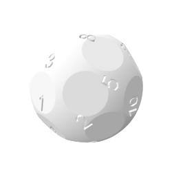

# n-die
OpenSCAD script to generate a n-sided die model for 3d printing.  View and generate models on [Thingiverse](https://www.thingiverse.com/thing:58408).

  

Sure, six choices are no match for a standard die. But what about picking from seven, eleven, or the unthinkable twenty-three choices? Until now, you were never able to leave it up to chance, forcing yourself to go through the agonizing processes of choosing. 

Well here comes the solution to all your multi-optioned problems - a customizable die for all your random number needs! You may have ninety-nine problems, but now choosing ain't one.

The die is designed to have a variable number of flat faces with a number on the opposite side. Wherever the die comes to rest, the associated number will show face up for easy reading.

Use the OpenSCAD script has parameters to modify number of sides, font and face depth, style and size of the font, as well as the model resolution. The procedural model uses the golden ratio to find the positions of reasonably even distribution of faces on a sphere for most values of n. Some smaller values of n use preset face angles. Due to most distributions being non-symmetrical, numbers will generally appear off-center of the flat faces in the die.

For best results of the lower hemisphere of the die, print using a raft and supports. Finish the bottom and sides using fine grain sandpaper.

*DEPENDENCY*: The script depends on the [Write.scad](https://www.thingiverse.com/thing:16193) library for number character generation.

*DISCLAIMER*: The distribution algorithm works well for large values of n, but it's not perfect. Other variables introduced while printing or sanding pretty much guarantee that it won't result in a perfectly fair die, but it's close!
